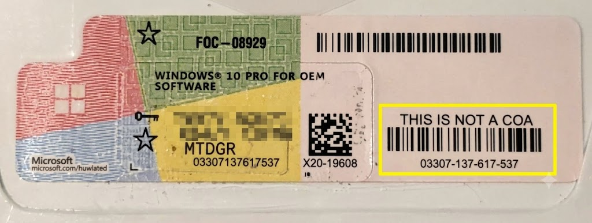

# Hướng dẫn định dạng Extended PID (EPID) của Windows

**Extended Product ID (EPID)** (Mã định danh sản phẩm mở rộng) là một chuỗi ký tự chữ-số được tạo bởi dịch vụ cấp phép phần mềm Windows (và các công cụ chẩn đoán như `pidgenx`). Bản thân nó **không** phải là một khóa sản phẩm (product key), mà là một chuỗi siêu dữ liệu có cấu trúc mô tả chính xác các thuộc tính của một giấy phép Windows.

Khi bạn chạy các lệnh như `slmgr /dlv` hoặc sử dụng các công cụ kiểm tra key, EPID sẽ được hiển thị để giúp quản trị viên xác định chính xác kênh phân phối (channel), nguồn gốc và lô sản xuất của giấy phép đó.

---

## Cấu trúc EPID Tiêu chuẩn

Một Extended PID tiêu chuẩn bao gồm 8 phần riêng biệt được phân tách bằng dấu gạch ngang, thường có dạng như sau:

> **`AAAAA-BBBBB-CCC-DDDDDD-EE-FFFF-GGGGG.0000-HHHHHHH`**

Sử dụng EPID mẫu của bạn (`XXXXX-03307-137-617537-02-1033-26200.0000-2222026`), dưới đây là cách đọc từng phần:

### 1. `AAAAA` (Nhóm Hệ điều hành / ID Ứng dụng)
*   **Ví dụ:** `XXXXX`, `03612`, `55041`
*   **Ý nghĩa:** Mã 5 chữ số xác định họ Hệ điều hành, ứng dụng hoặc Nhóm Product Key tổng quát. Mã này tương ứng trực tiếp với Application GUID trong Microsoft Software Protection Platform (SPP).

**Danh sách OS ID đầy đủ đã biết:**
*   **`03612`**: Windows 10 & 11 Client (Retail/OEM/MAK) **VÀ** Microsoft Office 2016, 2019, 2021
*   **`55041`**: KMS Host Server (Xác định rằng EPID được tạo bởi một máy chủ dịch vụ quản lý khóa KMS, chứ không phải máy khách cục bộ)
*   **`59146`**: Microsoft Office 2010
*   **`06401`**: Microsoft Office 2013
*(Lưu ý: Các hệ điều hành cũ hơn như Windows XP sử dụng cơ chế cấp phép khác, do đó không sử dụng định dạng EPID hiện đại tiêu chuẩn này).*

> [!NOTE]
> **Tại sao tôi lại thấy `XXXXX` trong WinLic?** Khi bạn sử dụng các công cụ ngoại tuyến hoặc của bên thứ ba để kiểm tra key (như `WinLic` hoặc `ShowKeyPlus`), các chương trình này gọi trực tiếp API nội bộ `PidGenX` của Windows. Hàm `PidGenX` yêu cầu một tham số `MPC` (Microsoft Product Code) để tạo chuỗi EPID. Vì các trình kiểm tra ngoại tuyến không phải lúc nào cũng biết chính xác OS ID cho mỗi key trước thời điểm kiểm tra, các nhà phát triển thường truyền một chuỗi thay thế chung chung vào API. File DLL `PidGenX` không thực sự xác thực chuỗi này—nó chỉ sao chép một cách mù quáng vào phần đầu của EPID kết quả! `WinLic` cố tình sử dụng `"XXXXX"` làm chuỗi giữ chỗ (placeholder) mặc định để người dùng nhận ra ngay lập tức rằng phần OS ID của EPID chỉ là một chuỗi thay thế, không phải là OS ID thực sự của Microsoft.

### 2. `BBBBB-CCC-DDDDDD` (ID Product Key / Số Sê-ri)
*   **Ví dụ:** `03307-137-617537`
*   **Ý nghĩa:** Khối 14 chữ số này (`BBBBBCCCDDDDDD`) chính là **Số Sê-ri duy nhất** (hoặc Key ID) của khóa sản phẩm cụ thể của bạn.
    *   **`BBBBB`**: Thường là Mã sản phẩm nhánh (BPC - Branch Product Code) hoặc ID của Nhóm Key cụ thể.
    *   **`CCC-DDDDDD`**: Số định danh sê-ri tuần tự trong nhóm đó.
*   > [!TIP]
    > **Xác minh vật lý:** Nếu bạn có bao bì đóng gói Retail hoặc OEM vật lý, việc bỏ các dấu gạch ngang khỏi phần này (ví dụ: `03307137617537`) sẽ khớp hoàn toàn với **Mã vạch COA** 14 chữ số được in trên tem chống giả vật lý của Microsoft.

### 3. `EE` (Kênh Phân phối Giấy phép)
*   **Ví dụ:** `02`
*   **Ý nghĩa:** Mã 2 chữ số biểu thị hình thức phân phối giấy phép (Kênh Kích hoạt). Các mã phổ biến bao gồm:
    *   `00` hoặc `01`: Retail (Phiên bản bán lẻ đóng gói đầy đủ)
    *   `02`: OEM (Nhà sản xuất thiết bị gốc)
    *   `03`: Volume Licensing (KMS - Key Management Service)
    *   `04`: Volume Licensing (MAK - Multiple Activation Key)
    *   `06`: OEM SLP (System Locked Pre-installation - Kích hoạt khóa cứng theo hệ thống)

### 4. `FFFF` (Mã Ngôn ngữ / LCID)
*   **Ví dụ:** `1033`
*   **Ý nghĩa:** ID Ngôn ngữ (Locale ID - LCID) tiêu chuẩn của Microsoft tại hệ thống nơi EPID được tạo hoặc xác thực.
    *   `1033`: Tiếng Anh (Mỹ)
    *   `1049`: Tiếng Nga
    *   `1066`: Tiếng Việt
    *   `0000`: Trung lập ngôn ngữ (thường thấy trong môi trường KMS)

### 5. `GGGGG.0000` (Số Build của Hệ điều hành)
*   **Ví dụ:** `26200.0000`
*   **Ý nghĩa:** Xác định chính xác Số Build của hệ điều hành máy chủ đã xử lý khóa hoặc tạo EPID. Ví dụ: `19045.0000` nghĩa là khóa được kiểm tra trên Windows 10 phiên bản 22H2, trong khi `26200.0000` cho thấy một bản build Windows 11 Insider/Server gần đây.

### 6. `HHHHHHH` (Ngày Julian)
*   **Ví dụ:** `2222026`
*   **Ý nghĩa:** Mã ngày gồm 7 chữ số cho biết chính xác thời điểm EPID này được tạo, được xác thực, hoặc thời điểm yêu cầu cấp phép được thực hiện. Nó sử dụng định dạng ngày Julian chuyên dụng đại diện cho năm và số ngày trong năm đó.

---

## Phân tích Tóm tắt theo Ví dụ

Nếu chúng ta giải mã EPID của bạn **`XXXXX-03307-137-617537-02-1033-26200.0000-2222026`**:

| Thành phần | Giá trị | Giải thích |
| :--- | :--- | :--- |
| **OS ID** | `XXXXX` | (Giữ chỗ do công cụ WinLic chèn vào) |
| **Số Sê-ri / COA** | `03307-137-617537` | ID của key khớp với mã vạch vật lý `03307137617537`. |
| **Kênh (Channel)** | `02` | Đây là giấy phép loại **OEM**. |
| **Ngôn ngữ** | `1033` | Được xác thực trong môi trường **Tiếng Anh (Mỹ)**. |
| **OS Build** | `26200.0000` | Được kiểm tra bằng hệ điều hành bản build **26200**. |
| **Mã Ngày** | `2222026` | Dấu thời gian Julian tại thời điểm thực hiện lệnh kiểm tra/tạo mã. |

> [!NOTE]
> Bởi vì EPID bao gồm các dữ liệu đặc thù theo môi trường hệ thống (như Số Build, Mã Ngôn ngữ và Ngày hiện tại), **cùng một Product Key chính xác đó sẽ tạo ra một EPID hơi khác nhau** nếu bạn kiểm tra nó trên một máy tính khác, bằng một ngôn ngữ khác hoặc vào một ngày khác! Tuy nhiên, phần cốt lõi Số Sê-ri (`BBBBB-CCC-DDDDDD`) sẽ luôn luôn giống hệt nhau.
